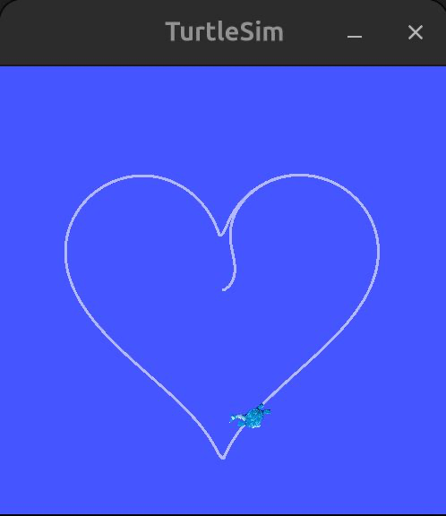

# 🐢 Turtlesim Heart using PID Control

This repository demonstrates how to draw a heart shape in ROS 2 Turtlesim using a PID controller. Instead of hardcoding waypoints, the turtle continuously tracks a mathematical heart curve and corrects its motion using feedback from its pose.

## Demo

<p align="center">
  
</p>

<p align="center"><i>The turtle drawing a heart shape using PID control</i></p>

---

## Overview

- Uses ROS 2 (Jazzy) and turtlesim
- A single ROS 2 node:
  - Subscribes to `/turtle1/pose`
  - Publishes velocity commands to `/turtle1/cmd_vel`
- A PID controller is applied on the angular error
- Linear velocity depends on distance to the target point
- The target moves along a parametric heart equation

---

## Heart Curve

The heart is defined using a parametric equation. A parameter `t` moves along the curve. For each value of `t`, a desired (x, y) point is computed. The turtle tries to reach and follow this moving point. As `t` increases, the turtle traces the heart smoothly.

---

## Control Logic (High Level)

1. Get current pose (x, y, theta) from turtlesim
2. Compute desired heart point (x_d, y_d)
3. Calculate distance error and heading error
4. Apply PID control on angular error
5. Publish Twist command
6. Increment `t` and repeat

---

## Why PID?

- **Proportional (P)**: Corrects immediate angular error
- **Integral (I)**: Removes steady-state bias (optional)
- **Derivative (D)**: Smoothens motion and reduces oscillations

PID allows smooth and stable tracking instead of jerky motion.

---

## Package Structure
```
heart_pkg/
├── heart_pkg/
│   └── heart_pid_controller.py
├── setup.py
├── package.xml
└── README.md
```

---

## How to Run

1. **Start turtlesim:**
```bash
ros2 run turtlesim turtlesim_node
```

2. **Build the workspace:**
```bash
# Create a workspace and clone this repository
mkdir -p ~/heart_ws/src
cd ~/heart_ws/src
git clone <your-repo-url>

# Build the workspace
cd ~/heart_ws
colcon build
source install/setup.bash
```

3. **Run the heart PID node:**
```bash
ros2 run heart_pkg heart_pid_exe
```

You should see the turtle drawing a heart.

---

## Tuning Tips

- Increase `kp` → faster turning, may oscillate
- Increase `kd` → smoother motion
- Reduce `t` increment → slower the increment, cleaner is the heart as it aims to travel more number of points in the parametric equation of the heart
- Reduce linear speed → more accurate shape

---

## Notes

- The control loop runs on a timer for consistent PID updates
- Pose updates come from the subscriber
- Angle normalization ensures shortest rotation direction
- The design is independent of pose update rate
